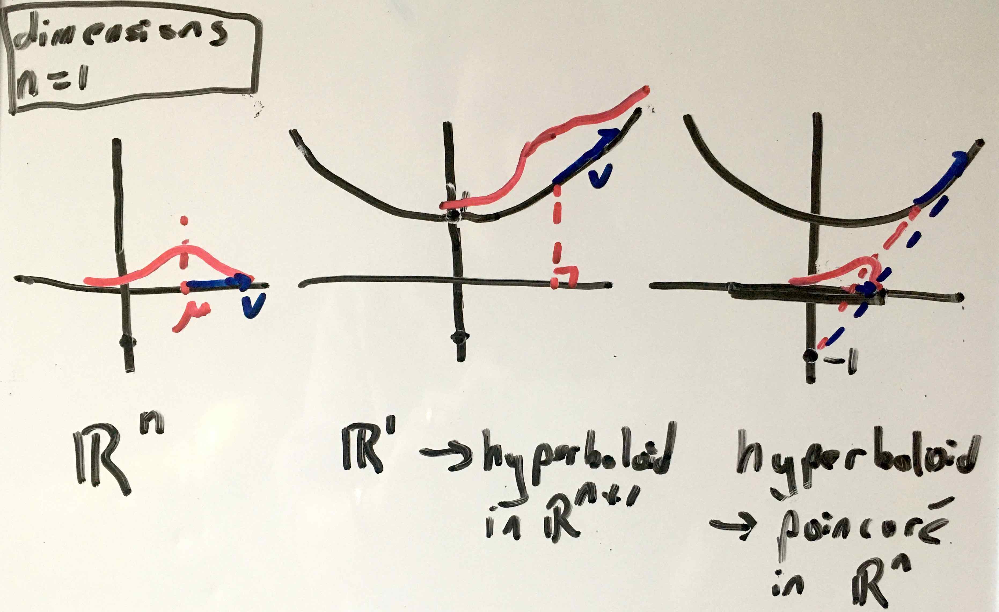

# dodonaphy

## Installing
Install the dodonaphy package using pip:
```
pip install dodonaphy
```
alternatively the package can be installed locally using
```
pip install -e .
```

## Running tests
Once the package is installed tests are run using pytest:
```
pytest
```

## Model
Distributions in R^n are first embedded onto the Hyperboloid model of hyperbolic
space in R^n+1. Then they are projected into the poincare ball in R^n.

The example below shows how a sample vector v is transformed.
The sample is taken from a 1D Gaussian, centred at mu.
In the first step, the vector is translated to the intercept of the Hyperboloid (at (1, 0, 0, 0, ...)), parallel translated to above mu the wrapped onto the hyperboloid with the exponential map.
In the second step, mu and v are projected into the Poincare ball using the stereographic projection.


